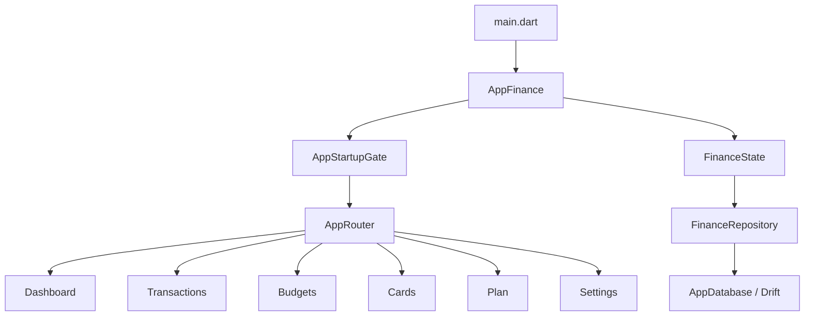
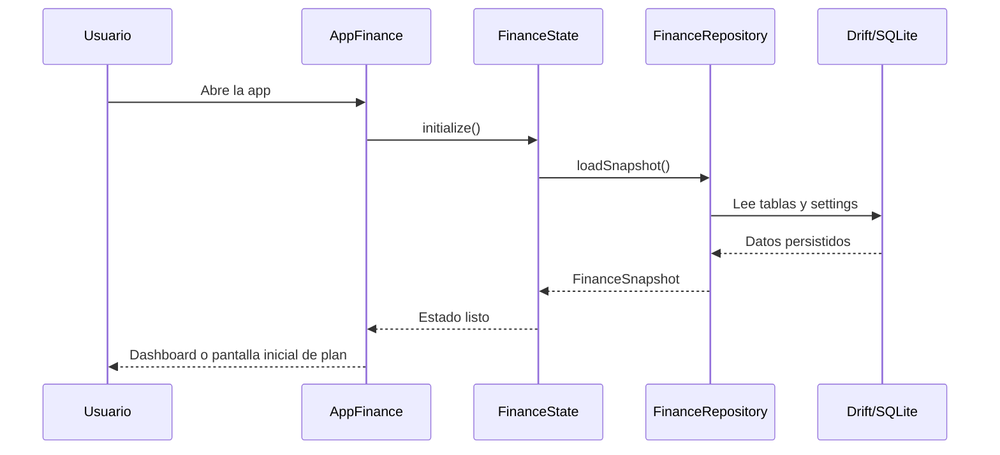
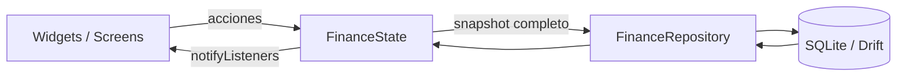

# App Finance

Aplicacion financiera personal en Flutter para controlar ingresos, presupuestos,
movimientos, tarjetas, suscripciones, tandas y planes de excedente desde una
misma base de datos local.

## Resumen

El proyecto ya no es un prototipo inicial. Hoy incluye:

- Persistencia local con Drift y SQLite para mobile y web.
- Estado global reactivo con `ChangeNotifier` + `InheritedNotifier`.
- Dashboard financiero con desglose navegable.
- Presupuestos por categoria y control de gasto libre.
- Registro de ingresos y gastos por periodo mensual.
- Tarjetas, compras a meses y pagos mensuales estimados o manuales.
- Planes de excedente con distribucion automatica o personalizada.
- Tareas financieras manuales y sugerencias de accion.
- Gestion de tandas con aportaciones y recepciones vinculadas a movimientos.
- Suite de pruebas y CI en GitHub Actions.

## Demo Arquitectonica



## Stack Tecnologico

| Area | Tecnologia |
| --- | --- |
| UI | Flutter + Material 3 |
| Lenguaje | Dart 3.4+ |
| Estado | `ChangeNotifier` + `InheritedNotifier` |
| Persistencia | Drift + SQLite |
| Plataformas | Android, iOS, Web |
| Generacion de codigo | `build_runner` + `drift_dev` |
| Lint | `flutter_lints` |
| CI | GitHub Actions |

## Estado Actual Del Producto

| Modulo | Estado | Alcance actual |
| --- | --- | --- |
| Dashboard | Activo | Resumen financiero, ingreso mensual, desglose hacia deuda, apartados y plan |
| Movimientos | Activo | Ingresos, gastos, categorias, filtros y captura por fecha |
| Presupuestos | Activo | Categorias editables, limites mensuales, colores y extras mensuales |
| Tarjetas | Activo | Alta/edicion, compras, saldo usado, pagos y mensualidades |
| Plan | Activo | Planes predefinidos, plan custom, tareas, consejo financiero y tandas |
| Tandas | Activo | Calendario, aportaciones, recepcion esperada y vinculacion con movimientos |
| Ajustes | Basico | Pantalla informativa; respaldo y preferencias siguen pendientes |
| Respaldo / sync | Pendiente | No hay sincronizacion en nube ni exportacion/importacion aun |

## Funcionalidades Principales

### 1. Resumen financiero mensual

- Ingreso mensual editable desde el dashboard.
- Calculo de dinero disponible por mes.
- Desglose de deudas, apartados, ahorro/inversion y dinero libre.
- Navegacion directa desde el resumen hacia tarjetas, presupuesto y plan.

### 2. Presupuestos y gasto libre

- Categorias de presupuesto con nombre, color y limite.
- Calculo de gasto por periodo usando los movimientos registrados.
- Deteccion separada de gasto libre o no presupuestado.
- Extras mensuales integrables al apartado del mes.

### 3. Movimientos

- Registro manual de ingresos y gastos.
- Asociacion con categoria elegida por el usuario.
- Seleccion de fecha real del movimiento.
- Filtrado por tipo y consulta del periodo seleccionado.

### 4. Tarjetas y compras a meses

- Tarjetas con nombre, limite, saldo usado y dia de corte.
- Registro de compras unicas o a meses.
- Calculo de mensualidad estimada por tarjeta.
- Pagos confirmados y ajustes del monto mensual esperado.

### 5. Plan de excedente

Tipos disponibles en el dominio:

| Tipo | Logica |
| --- | --- |
| `unconfigured` | Estado inicial; obliga a elegir un enfoque antes de entrar |
| `none` | Todo el sobrante queda como dinero libre |
| `conservative` | 60% colchon, 25% inversion, 15% libre |
| `balanced` | 40% colchon, 40% inversion, 20% libre |
| `investment` | 20% colchon, 65% inversion, 15% libre |
| `custom` | Montos manuales definidos por el usuario |

### 6. Tareas financieras

- Tareas manuales con monto, estado, notas y monto real parcial.
- Overrides persistidos para ajustar tareas derivadas.
- Generacion de recomendaciones financieras desde el estado actual.

### 7. Tandas

- Alta de tandas con frecuencia semanal, quincenal o mensual.
- Calendario de aportaciones generado automaticamente.
- Recepcion esperada persistida por turno asignado.
- Vínculo entre aportaciones/recepciones y movimientos financieros.
- Eliminacion con opcion de conservar o limpiar movimientos vinculados.

## Flujo De Arranque



## Arquitectura

### Estructura general

```text
lib/
  main.dart
  src/
    app/
      app.dart
      app_startup_gate.dart
      router/
    core/
      constants/
      database/
      domain/
      state/
      theme/
      utils/
    features/
      budgets/
      cards/
      dashboard/
      plan/
      planning/
      settings/
      subscriptions/
      tandas/
      tasks/
      transactions/
    shared/
      presentation/
test/
```

### Capas

| Capa | Responsabilidad |
| --- | --- |
| `app/` | Bootstrap, ciclo de vida, arranque y navegación principal |
| `core/state/` | Estado global, cálculos financieros, mutaciones y coordinación de guardado |
| `core/database/` | Esquema Drift, snapshot persistente, migraciones y repositorio |
| `features/*/domain` | Entidades y reglas del módulo |
| `features/*/presentation` | Pantallas, dialogs y widgets de cada feature |
| `shared/presentation` | Sistema visual compartido y scaffolds comunes |

### Flujo de datos actual



## Persistencia

La persistencia se implementa con Drift en
`lib/src/core/database/app_database.dart`.

### Detalles importantes

- `schemaVersion` actual: `4`.
- Se habilita `PRAGMA foreign_keys = ON`.
- La app usa `DriftWebOptions` para funcionamiento en web.
- El arranque siembra un snapshot vacio si aun no existe informacion previa.

### Tablas principales

| Tabla | Uso |
| --- | --- |
| `app_settings` | Flags globales y nomina mensual |
| `budget_categories` | Categorias y limites |
| `transactions` | Ingresos y gastos |
| `planned_expenses` | Gastos planeados |
| `credit_cards` | Tarjetas |
| `credit_card_purchases` | Compras, incluidas compras a meses |
| `credit_card_monthly_payments` | Monto mensual confirmado o estimado |
| `subscriptions` | Cargos recurrentes |
| `monthly_extras` | Extras del mes |
| `surplus_plans` | Configuracion del plan |
| `financial_tasks` | Tareas manuales |
| `financial_task_overrides` | Ajustes persistidos de tareas |
| `tandas` | Cabecera de cada tanda |
| `tanda_contributions` | Aportaciones programadas o pagadas |
| `tanda_receipts` | Recepcion esperada o registrada |

### Migraciones actuales

| Version | Cambio |
| --- | --- |
| `1` | Esquema base |
| `2` | Tabla `tandas` |
| `3` | Tabla `tanda_contributions` + migracion del contador legado |
| `4` | Tabla `tanda_receipts` + recepcion pendiente por tanda existente |

### Limitacion conocida

La estrategia de guardado principal sigue basada en snapshots completos:
`FinanceRepository.saveSnapshot()` borra y reescribe todas las tablas dentro de
una transaccion. Es consistente para el estado actual del proyecto, pero sigue
siendo una deuda tecnica para escalar escrituras y migrar a operaciones mas
granulares.

## Experiencia De Usuario

### Navegacion principal

| Seccion | Proposito |
| --- | --- |
| Dashboard | Ver estado financiero general |
| Movimientos | Registrar y consultar ingresos/gastos |
| Presupuesto | Administrar categorias y apartados |
| Tarjetas | Controlar deuda, pagos y compras |
| Plan | Distribuir excedente, tareas y tandas |
| Ajustes | Ver configuracion general de la app |

### Arranque controlado

La app no entra directamente al contenido si:

- La base local aun esta cargando.
- Hubo un error al leer los datos persistidos.
- El usuario aun no elige un plan inicial (`unconfigured`).
- Existe un error de guardado pendiente y hace falta reintento.

## Calidad y Verificacion

El repositorio incluye:

- Reglas de lint en `analysis_options.yaml`.
- Suite de pruebas en `test/`.
- Workflow de CI en `.github/workflows/flutter-ci.yml`.

### Cobertura de verificacion incluida en el repo

| Tipo | Estado en repositorio |
| --- | --- |
| Formato | `dart format --output=none --set-exit-if-changed lib test` |
| Analisis estatico | `flutter analyze` |
| Pruebas | `flutter test --reporter expanded` |
| Integracion continua | GitHub Actions sobre `main` y `dev` |

### Archivos de pruebas presentes

Actualmente hay `16` archivos de prueba bajo `test/`, incluyendo casos para:

- `FinanceState`
- `FinanceRepository`
- periodos financieros
- arranque de la app
- consejo financiero
- normalizacion de graficas
- tandas, aportaciones, recepciones y vinculacion con movimientos
- smoke/widget testing

## Requisitos

| Requisito | Version o nota |
| --- | --- |
| Flutter | `3.44.0` estable |
| Dart | `3.12.0` |
| SDK declarado en `pubspec.yaml` | `>=3.4.0 <4.0.0` |

## Primer Arranque

```sh
flutter pub get
dart run build_runner build
flutter run
```

## Comandos Utiles

```sh
flutter pub get
dart run build_runner build
dart format --output=none --set-exit-if-changed lib test
flutter analyze
flutter test --reporter expanded
flutter run
```

## Dependencias Principales

```yaml
dependencies:
  flutter:
    sdk: flutter
  drift: ^2.32.0
  drift_flutter: 0.3.0

dev_dependencies:
  build_runner: ^2.5.4
  drift_dev: 2.33.0
  flutter_test:
    sdk: flutter
  flutter_lints: ^4.0.0
```

## Decisiones De Diseño Relevantes

- Estado centralizado en `FinanceState` para simplificar la sincronizacion de
  reglas de negocio entre modulos.
- Capa visual compartida en `shared/presentation` para mantener coherencia del
  look and feel.
- Persistencia local antes que sincronizacion en nube.
- Soporte de web mediante Drift + `sqlite3.wasm` + worker dedicado.
- Flujo inicial obligatorio para decidir como manejar el excedente mensual.

## Riesgos y Deuda Tecnica Visible

| Tema | Situacion |
| --- | --- |
| Relacion movimiento-categoria | Aun usa el nombre de categoria en lugar de un ID estable |
| Persistencia | Guardado por snapshot completo |
| Tamano de clases | `FinanceState` y varias pantallas concentran mucha logica |
| Migraciones futuras | Exigen estrategia mas formal conforme crezca el esquema |
| Ajustes | Pantalla basica; varias opciones siguen marcadas como pendientes |
| Respaldo | Sin exportacion, importacion ni sincronizacion remota |

## Roadmap Sugerido

1. Migrar movimientos para referenciar categorias por identificador estable.
2. Reducir el guardado por snapshot completo hacia escrituras granulares.
3. Dividir `FinanceState` y las pantallas mas grandes en componentes o casos de uso.
4. Formalizar migraciones futuras y escenarios de recuperacion.
5. Agregar respaldo local/exportacion y, si aplica, sincronizacion remota.
6. Completar ajustes reales para moneda, alertas, privacidad y datos.

## Archivos Clave

| Archivo | Rol |
| --- | --- |
| `lib/main.dart` | Entrada principal |
| `lib/src/app/app.dart` | Inicializacion de app, estado y repositorio |
| `lib/src/app/app_startup_gate.dart` | Control del arranque y errores |
| `lib/src/app/router/app_router.dart` | Navegacion principal |
| `lib/src/core/state/finance_state.dart` | Estado financiero y logica central |
| `lib/src/core/database/app_database.dart` | Esquema Drift y migraciones |
| `lib/src/core/database/repositories/finance_repository.dart` | Carga y guardado del snapshot |
| `CODEX_CONTEXT.md` | Bitacora tecnica viva del proyecto |

## Nota Sobre La Documentacion

Este `README.md` describe el estado actual del repositorio segun el codigo
presente. Para decisiones de trabajo, riesgos historicos y bitacora tecnica,
consulta tambien `CODEX_CONTEXT.md`.
